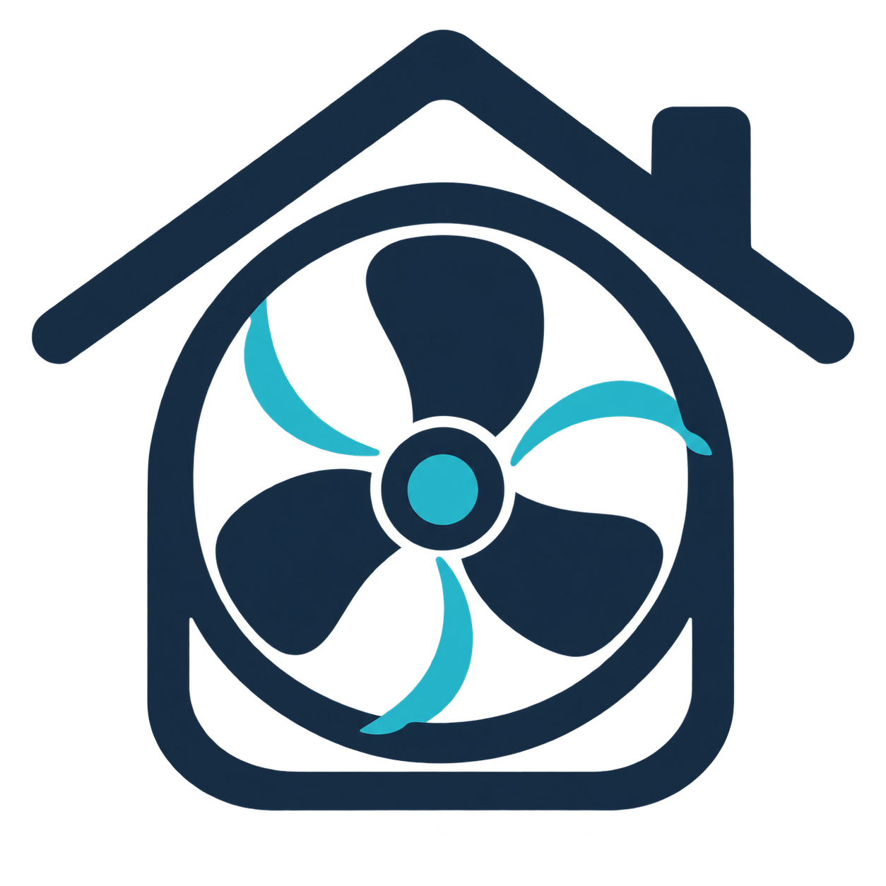
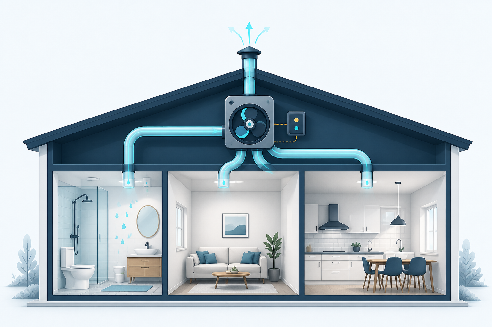

# Central Extract Fan

<p align="center">
  
</p>

<p align="center">
  
</p>

Home Assistant custom integration for a three-speed central extract fan, including relay-controlled systems commonly found in Villavent and Flexit installations. It provides humidity regulation, manual presets, timed boost, optional silent hours, RPM diagnostics, and indicator outputs.

## Install with HACS as a custom repository

1. In HACS, open **Custom repositories**.
2. Add `https://github.com/bkflatekvaal/ha-central-extract-fan` and choose category **Integration**.
3. Find **Central Extract Fan** in HACS and select **Download**.
4. Restart Home Assistant.
5. Go to **Settings → Devices & services → Add integration → Central Extract Fan**.

The GitHub repository must be public. Manual installation is also possible by copying `custom_components/central_extract_fan` to Home Assistant's `custom_components` directory.

## Hardware mapping

| Level | CH1 | CH2 |
|---|---|---|
| Off | Off | Off |
| Low | On | Off |
| Medium | Off | On |
| High | On | On |

Only changed relays are actuated. Low/Medium swaps use break-before-make switching with the configured millisecond delay (default 500 ms):

- Low → Off → Medium
- Medium → Off → Low

This deliberately avoids a temporary High state and its noticeable burst of fan noise. Direct transitions between High and Low or Medium change only the one relay that differs and incur no switching delay. Existing entries using the old seconds-based setting are converted to milliseconds automatically.

## Configuration and humidity control

Initial setup asks only for CH1, CH2, and one or more humidity sensors. The selector shows humidity-class sensors. Unavailable, unknown, and non-numeric values are ignored. Options allow changing both control relays and humidity sensors later, along with thresholds, hysteresis, boost duration, switching delay, silent hours, RPM settings, and multiple indicator switches per channel.

The highest valid humidity reading controls the fan. If none is valid, the fault entity turns on and automatic mode falls back to Low. With medium 60%, high 75%, and hysteresis 5 points: Low rises at 65%, Medium falls at 55%, Medium rises at 80%, and High falls at 70%. Inside each band the prior request is retained, with no dead zones.

## Modes, boost, and silent hours

The fan presets are **Auto**, **Low**, **Medium**, and **High** by default. Enable **Show and allow Off in fan controls** to expose and permit the Off preset. When disabled, Off is omitted from the preset list and zero-percent or turn-off commands resolve safely to Low. Some Home Assistant dashboards may still render the fan domain's standard power button, but it cannot stop this fan while Off is disabled. Selecting a speed creates a persistent manual override; select Auto (or turn on Automatic control) to resume regulation. Normal automatic humidity control never requests Off.

Control priority is: **Timed override (Boost) → Manual override → Automatic humidity control**. Silent hours cap automatic control only; they never cap a timed override or manual level.

Silent hours are disabled unless a schedule entity is selected. Its automatic maximum may be Off, Low, or Medium; choosing Off is sufficient and requires no additional permission checkbox. A diagnostic timestamp shows the schedule's next change when Home Assistant provides it. The configured humidity thresholds and hysteresis are also exposed as diagnostic sensors.

### Start and cancel Boost

**Start boost** always starts a temporary **High** override using the configured Boost duration. It does not change whether the fan is in Auto or Manual mode. That underlying mode continues to update while Boost is active and takes over again when the timer expires.

Examples:

- Auto currently requests Low → Start boost → High until expiry → current Auto level.
- Auto currently requests Medium → Start boost → High until expiry → current Auto level.
- Manual Low → Start boost → High until expiry → Manual Low.
- Auto already requests High → Start boost → an active High override still runs for the full duration. If humidity falls during that time, the fan remains High until expiry.

Pressing **Start boost** again replaces the active override and restarts its timer using the configured duration. **Cancel boost** ends the override immediately and returns to the current underlying Auto or Manual state.

Boost status is available through the **Boost active** binary sensor, **Boost remaining** sensor, and restart-safe **Boost ends at** timestamp. If Home Assistant restarts during an override, the actual override level and original expiry are restored; the timer is not reset or extended.

### Automation actions

The integration provides `central_extract_fan.start_boost` and `central_extract_fan.cancel_boost`. Calling `start_boost` without data has the same unambiguous meaning as the button: **High for the configured duration**.

```yaml
action: central_extract_fan.start_boost
target:
  entity_id: fan.central_extract_fan
```

An automation can optionally request `low`, `medium`, or `high`, and a duration from 1 to 240 minutes. This creates a timed override at that exact level. For example, Medium is held for 30 minutes even if automatic humidity control changes underneath it:

```yaml
action: central_extract_fan.start_boost
target:
  entity_id: fan.central_extract_fan
data:
  level: medium
  duration: 30
```

When this example expires, the fan returns to the Auto level calculated at that time, or to its preserved Manual level. External scene controllers can therefore map a single press to normal High boost and a double press to an explicit Medium override. The integration remains independent of the scene controller or relay hardware.

Cancel an override from an automation:

```yaml
action: central_extract_fan.cancel_boost
target:
  entity_id: fan.central_extract_fan
```

The Start boost button entity can also be pressed from an automation (select the generated entity ID used by your installation):

```yaml
action: button.press
target:
  entity_id: button.central_extract_fan_start_boost
```

## Entities

Entity IDs are generated by Home Assistant and may differ from the examples below. Diagnostic and configuration entities may be disabled or grouped separately in some dashboards.

### Controls

| Entity | Purpose |
|---|---|
| **Central Extract Fan** (`fan`) | Main fan control. Select Auto for humidity regulation or Low, Medium, and High for a persistent manual override. It also reports the effective speed as 33%, 66%, or 100%. Off is available only when **Show and allow Off in fan controls** is enabled. |
| **Automatic control** (`switch`) | On means Auto mode. Turning it off preserves the fan's current effective level as a manual override; turning it on clears the manual override and resumes humidity control. |
| **Boost duration** (`number`) | Configures the duration used by the Start boost button and by `start_boost` calls that omit `duration`. Valid range: 1–240 minutes. Changing it does not alter an override already in progress. |
| **Start boost** (`button`) | Starts or restarts a High override using the configured Boost duration. |
| **Cancel boost** (`button`) | Ends the active timed override immediately and resumes the underlying Manual or Auto state. |

### Status sensors

| Entity | Purpose |
|---|---|
| **Control humidity** | Highest valid reading from the configured humidity sensors. This is the value used by automatic control. |
| **Humidity source** | Entity ID of the humidity sensor currently providing the highest valid reading. |
| **Requested level** | Low, Medium, or High currently requested by the humidity controller before Manual, Boost, or silent-hours rules are applied. |
| **Effective level** | Final commanded fan level after timed override, Manual, Auto, and silent-hours precedence have been applied. |
| **Control source** | Explains why the effective level was selected: `boost`, `manual`, `humidity`, `humidity+silent`, or `fallback`. |
| **Boost remaining** | Whole seconds remaining in the active timed override; zero when inactive. |
| **Boost ends at** | Exact expiry timestamp for the active override; unavailable when inactive. |
| **Boost active** | On whenever a timed override is active. |
| **Silent hours active** | Mirrors whether the configured schedule is currently active. |

For example, during a silent-hours period the sensors might show **Requested level = High**, **Effective level = Low**, and **Control source = humidity+silent**. During Boost, the effective level and source change to **High** and **boost**, while Requested level continues tracking humidity underneath.

### Diagnostics and configured values

| Entity | Purpose |
|---|---|
| **Humidity sensor fault** | On when none of the configured humidity sensors has a valid numeric reading. Automatic mode then falls back to Low. |
| **Fan fault** | On when RPM feedback is missing or outside the configured tolerance after the settling period. Available RPM diagnostics never control the fan. |
| **Expected RPM** | Configured expected RPM for the effective fan level. It is unavailable when no expected value is configured. |
| **RPM deviation** | Measured RPM minus expected RPM, rounded to a whole RPM. Positive means faster than expected; negative means slower. |
| **Threshold medium** | Configured humidity threshold used for Medium automatic control. |
| **Threshold high** | Configured humidity threshold used for High automatic control. |
| **Threshold hysteresis** | Configured percentage-point margin that prevents rapid switching around humidity thresholds. |
| **Next silent-hours change** | Next event timestamp reported by the configured schedule entity. It is unavailable when no schedule or next event is present. |

## RPM diagnostics and indicators

RPM feedback is diagnostic only. Expected RPM and whole-number RPM deviation remain live during the settling period; only fan-fault evaluation is delayed. RPM diagnostics never alter speed. Indicator switches mirror commanded CH1/CH2 states; unavailable indicators are skipped.

At startup the physical speed is derived from CH1/CH2 without writing relays. Home Assistant restoration then restores manual/boost state and the controller safely converges to the required level.
